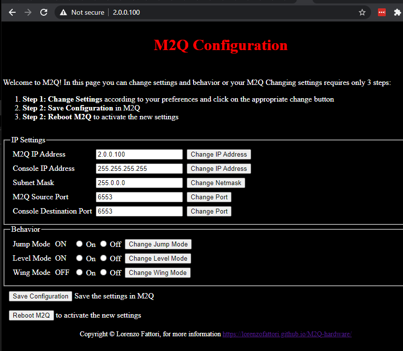

# Change M2Q Configuration

You can change the configuration of M2Q via the built-in web server.
In order to access the web server, plug a PC to the M2Q **Ethernet** port. Then power on M2Q via USB. You can also connect M2Q to a switch (Chamsys built-in switch is also fine) and plug the PC to the same network.
Using a web browser, go to M2Q IP Address, default is 2.0.0.100.

### M2Q IP Address

The default value is 2.0.0.100

Use this field to change the IP address of M2Q

**Note:** after changing M2Q IP Address, the web page will be accessible to the new address!
Remember which IP you set, otherwise you will not be able to access the cofniguration webpage anymore!

### Console IP Address	

The default value is 255.255.255.255

Use this field to change the destination of the IP messages for the Chamstys console

**Note:** the default address is 255.255.255.255, which means broadcast message, every chamsys console in the network will receive the message and act to it. If you set to a unicast IP address, only the console at that IP address will act to M2Q messages

### Subnet Mask		

The default value is 255.0.0.0

Use this field to change the subnet mask of M2Q

### M2Q Source Port	

The default value is 6553

The source port of the UDP messages sent by M2Q, the default value is ok for most cases.

### Console Destination Port

The default value is 6553

The destination port of the UDP messages sent by M2Q, this must match the Playback Sync Port of Chamsys
	

### Jump Mode

The default value is ON

This settings enables/disables Triggering cues on Chamsys Playbacks

### Level Mode

The default value is ON

This settings enables/disables Changing Playback Level on Chamsys Playbacks

### Wing Mode

The default value is OFF

When this option is selected, M2Q will trigger the playbacks from 11 to 25 instead of 1 to 15, in this way you can still use your first 10 playbacks manually and have the "automated" triggering on the first wing playbacks.
This functionalities does not work with MagicQ PC software, as playback control is limited to playback 1 to 10.

## How to change M2Q Configuration

1. Change Settings according to your preferences and immediately click on the appropriate change button
2. Save Configuration in M2Q
3. Reboot M2Q to activate the new settings

## Looking for a webpage designer!

As you can see I'm not an expert webpage developer! If you know how to program a sexy webpage and you are willing to help, contact me!
