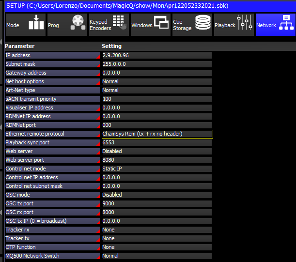
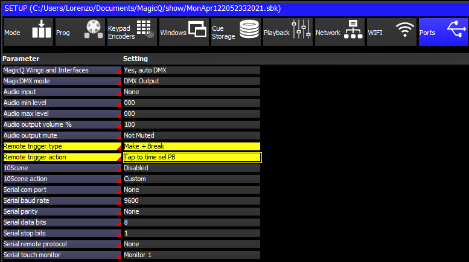

# Quick Start Guide

Using M2Q is very simple! By default, M2Q is configured to send Broadcast messages to all the consoles in the network, you can change this in the [Configuration Page](./configuration.md)

### Set up Chamsys
Before you start using M2Q, you have to configure your Chamsys console/PC (Note: Software needs to be unlocked in order to receive remote control messages!):

- Make sure your Chamsys Console and M2Q are on the same IP network range, by default M2Q is in the 2.x.x.x subnet.

- Settings > Multi Console > Enable remote control and Enabler remote access: YES

- Settings > Network > Ethernet remote protocol: Chamsys Rem (TX+RX no header)
- Settings > Network > Playback sync port: must be the same of M2Q (default 6553)

- Settings > Ports > Remote trigger type: Make + Break
- Settings > Ports > Remote trigger action: Tap to time sel PB

- Settings > Playback > Crossfade button function: Global Tap to time

### Connect M2Q

1. Connect M2Q to the Console via Ethernet

2. Connect M2Q to your PC/MAC via USB

3. M2Q will power up, the 3 leds will flash in sequence

4. Open yout MIDI software, M2Q will appear in your connected MIDI devices

5. Start sending MIDI messages 

6. M2Q will immediately start sending Chamsys Remote messages, Enjoy it!
